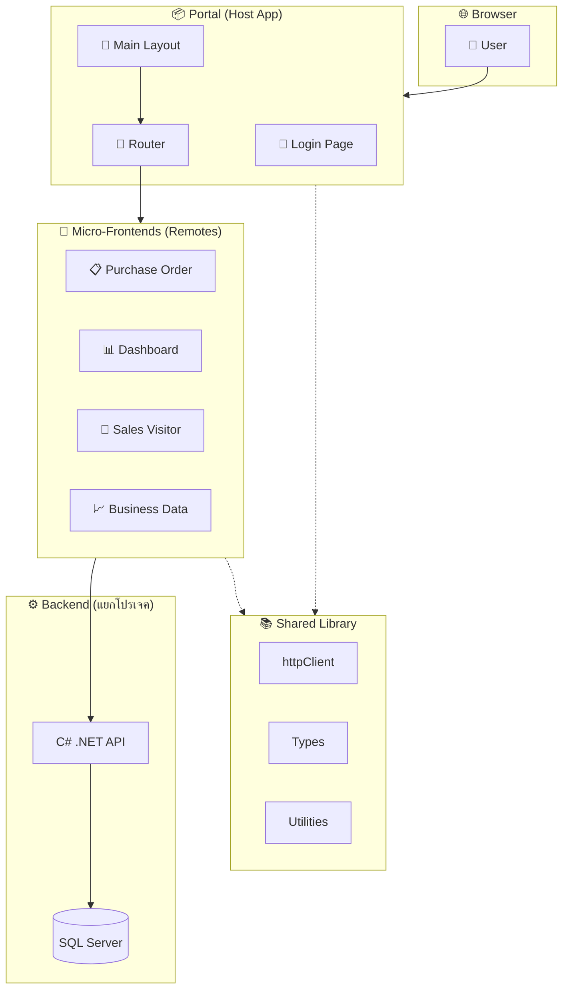
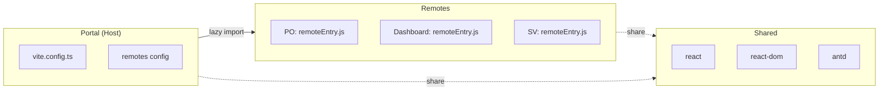
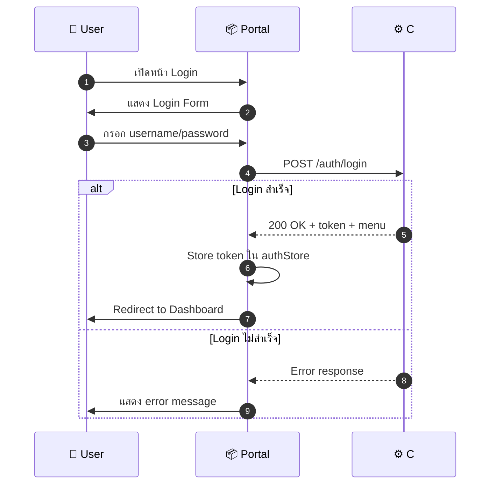
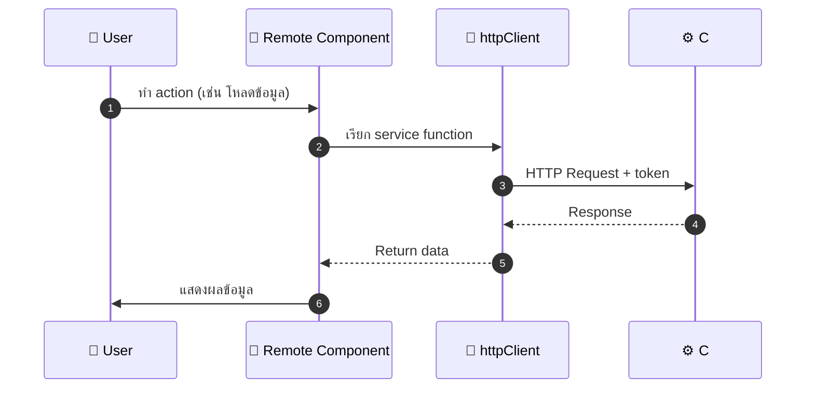
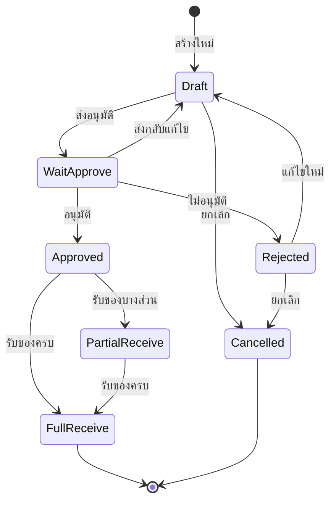
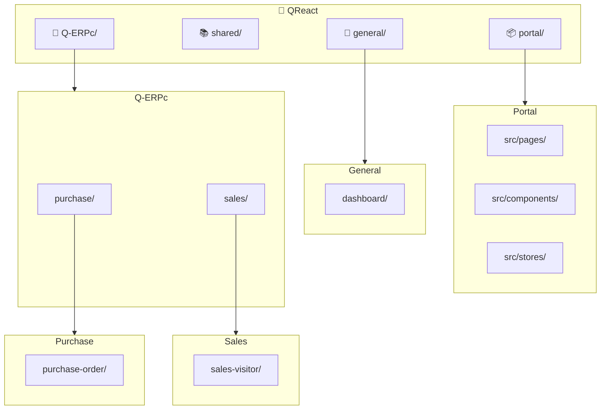
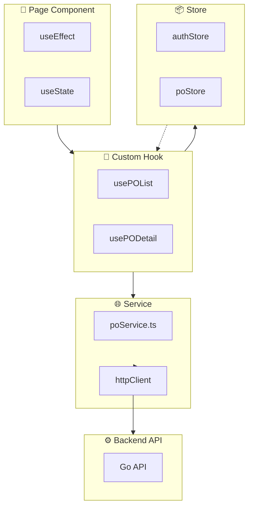
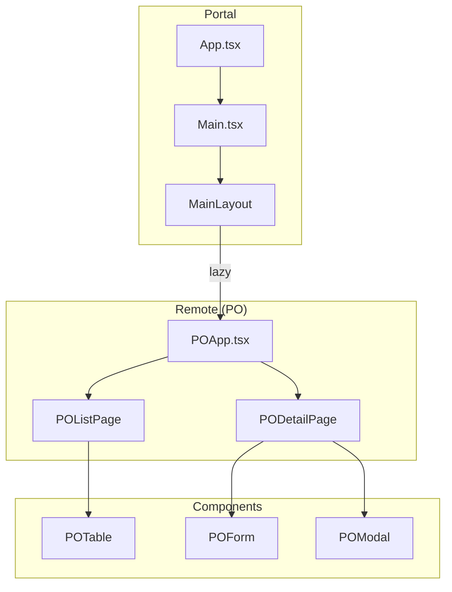
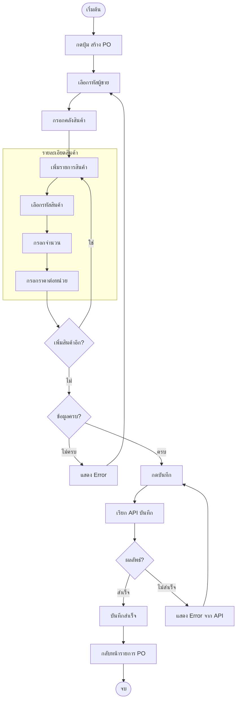

# Q-ERP Mermaid Diagrams

> รวม Mermaid code พร้อมใช้ - copy ไปวางได้เลย
> อัพเดท: 29 ธันวาคม 2025

---

## 1. Q-ERP Architecture Overview

---

## 2. Module Federation Flow

---

## 3. Login Flow

---

## 4. API Request Flow

---

## 5. PO Status Flow

---

## 6. Folder Structure

---

## 7. Data Flow in Remote Module

---

## 8. Component Hierarchy

---

## 9. PO Create Flow - User Flow

---

*อัพเดทโดย: AI Assistant*
*สำหรับ: ปิงปอง* 📊
