# Q-ERP Mermaid Diagrams

> รวม Mermaid code พร้อมใช้ - copy ไปวางได้เลย
> อัพเดท: 29 ธันวาคม 2025

---

## 1. Q-ERP Architecture Overview

```mermaid
flowchart TB
    subgraph Client["🌐 Browser"]
        User[👤 User]
    end

    subgraph Host["📦 Portal (Host App)"]
        Login[🔐 Login Page]
        Layout[📐 Main Layout]
        Router[🔀 Router]
    end

    subgraph MFE["🧩 Micro-Frontends (Remotes)"]
        PO[📋 Purchase Order]
        Dashboard[📊 Dashboard]
        SV[🚗 Sales Visitor]
        BDM[📈 Business Data]
    end

    subgraph Shared["📚 Shared Library"]
        HTTP[httpClient]
        Types[Types]
        Utils[Utilities]
    end

    subgraph Backend["⚙️ Backend (แยกโปรเจค)"]
        API[C# .NET API]
        DB[(SQL Server)]
    end

    User --> Host
    Layout --> Router
    Router --> MFE
    MFE -.-> Shared
    Host -.-> Shared
    MFE --> API
    API --> DB
```

---

## 2. Module Federation Flow

---

## 3. Login Flow

```mermaid
sequenceDiagram
    autonumber
    participant U as 👤 User
    participant P as 📦 Portal
    participant A as ⚙️ C# .NET API

    U->>P: เปิดหน้า Login
    P->>U: แสดง Login Form

    U->>P: กรอก username/password
    P->>A: POST /auth/login

    alt Login สำเร็จ
        A-->>P: 200 OK + token + menu
        P->>P: Store token ใน authStore
        P->>U: Redirect to Dashboard
    else Login ไม่สำเร็จ
        A-->>P: Error response
        P->>U: แสดง error message
    end
```

---

## 4. API Request Flow

```mermaid
sequenceDiagram
    autonumber
    participant U as 👤 User
    participant C as 🧩 Remote Component
    participant H as 📡 httpClient
    participant A as ⚙️ C# .NET API

    U->>C: ทำ action (เช่น โหลดข้อมูล)
    C->>H: เรียก service function
    H->>A: HTTP Request + token
    A-->>H: Response
    H-->>C: Return data
    C->>U: แสดงผลข้อมูล
```

---

## 5. PO Status Flow

```mermaid
stateDiagram-v2
    [*] --> Draft: สร้างใหม่

    Draft --> WaitApprove: ส่งอนุมัติ
    Draft --> Cancelled: ยกเลิก

    WaitApprove --> Approved: อนุมัติ
    WaitApprove --> Rejected: ไม่อนุมัติ
    WaitApprove --> Draft: ส่งกลับแก้ไข

    Rejected --> Draft: แก้ไขใหม่
    Rejected --> Cancelled: ยกเลิก

    Approved --> PartialReceive: รับของบางส่วน
    Approved --> FullReceive: รับของครบ

    PartialReceive --> FullReceive: รับของครบ

    FullReceive --> [*]
    Cancelled --> [*]
```

---

## 6. Folder Structure

```mermaid
flowchart TB
    subgraph Root["📁 QReact"]
        Portal["📦 portal/"]
        Shared["📚 shared/"]
        General["📁 general/"]
        QERP["📁 Q-ERPc/"]
    end

    subgraph PortalDetail["Portal"]
        P1[src/pages/]
        P2[src/components/]
        P3[src/stores/]
    end

    subgraph GeneralDetail["General"]
        G1[dashboard/]
    end

    subgraph QERPDetail["Q-ERPc"]
        Q1[purchase/]
        Q2[sales/]
    end

    subgraph PurchaseDetail["Purchase"]
        PU1[purchase-order/]
    end

    subgraph SalesDetail["Sales"]
        SA1[sales-visitor/]
    end

    Portal --> PortalDetail
    General --> GeneralDetail
    QERP --> QERPDetail
    Q1 --> PurchaseDetail
    Q2 --> SalesDetail
```

---

## 7. Data Flow in Remote Module

```mermaid
flowchart TB
    subgraph Page["📄 Page Component"]
        P1[useEffect]
        P2[useState]
    end

    subgraph Hook["🔗 Custom Hook"]
        H1[usePOList]
        H2[usePODetail]
    end

    subgraph Service["🌐 Service"]
        S1[poService.ts]
        S2[httpClient]
    end

    subgraph Store["📦 Store"]
        ST1[authStore]
        ST2[poStore]
    end

    subgraph API["⚙️ Backend API"]
        A1[Go API]
    end

    Page --> Hook
    Hook --> Service
    Hook --> Store
    Service --> S2
    S2 --> API
    Store -.-> Hook
```

---

## 8. Component Hierarchy

---

## 9. PO Create Flow - User Flow

```mermaid
flowchart TD
    Start([เริ่มต้น]) --> ClickCreate[กดปุ่ม สร้าง PO]

    ClickCreate --> SelectVendor[เลือกรหัสผู้ขาย]
    SelectVendor --> InputWarehouse[กรอกคลังสินค้า]

    InputWarehouse --> AddItem[เพิ่มรายการสินค้า]

    subgraph ItemDetail["รายละเอียดสินค้า"]
        AddItem --> SelectItem[เลือกรหัสสินค้า]
        SelectItem --> InputQty[กรอกจำนวน]
        InputQty --> InputPrice[กรอกราคาต่อหน่วย]
    end

    InputPrice --> CheckMore{เพิ่มสินค้าอีก?}
    CheckMore -->|ใช่| AddItem
    CheckMore -->|ไม่| CheckValid{ข้อมูลครบ?}

    CheckValid -->|ไม่ครบ| ShowError[แสดง Error]
    ShowError --> SelectVendor

    CheckValid -->|ครบ| ClickSave[กดบันทึก]
    ClickSave --> CallAPI[เรียก API บันทึก]

    CallAPI --> APIResult{ผลลัพธ์?}
    APIResult -->|สำเร็จ| ShowSuccess[บันทึกสำเร็จ]
    APIResult -->|ไม่สำเร็จ| ShowAPIError[แสดง Error จาก API]

    ShowSuccess --> GoToList[กลับหน้ารายการ PO]
    ShowAPIError --> ClickSave

    GoToList --> End([จบ])
```

---

*อัพเดทโดย: AI Assistant*
*สำหรับ: ปิงปอง* 📊
