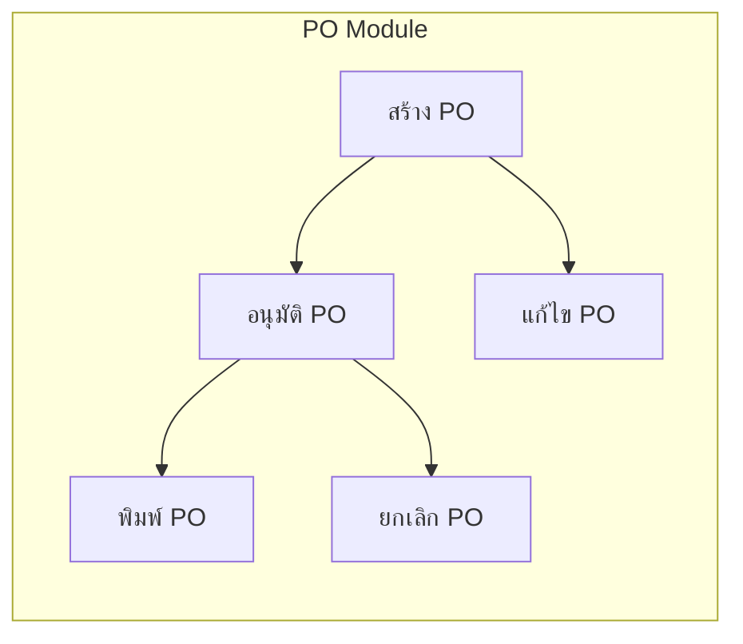
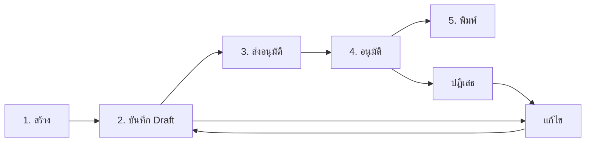
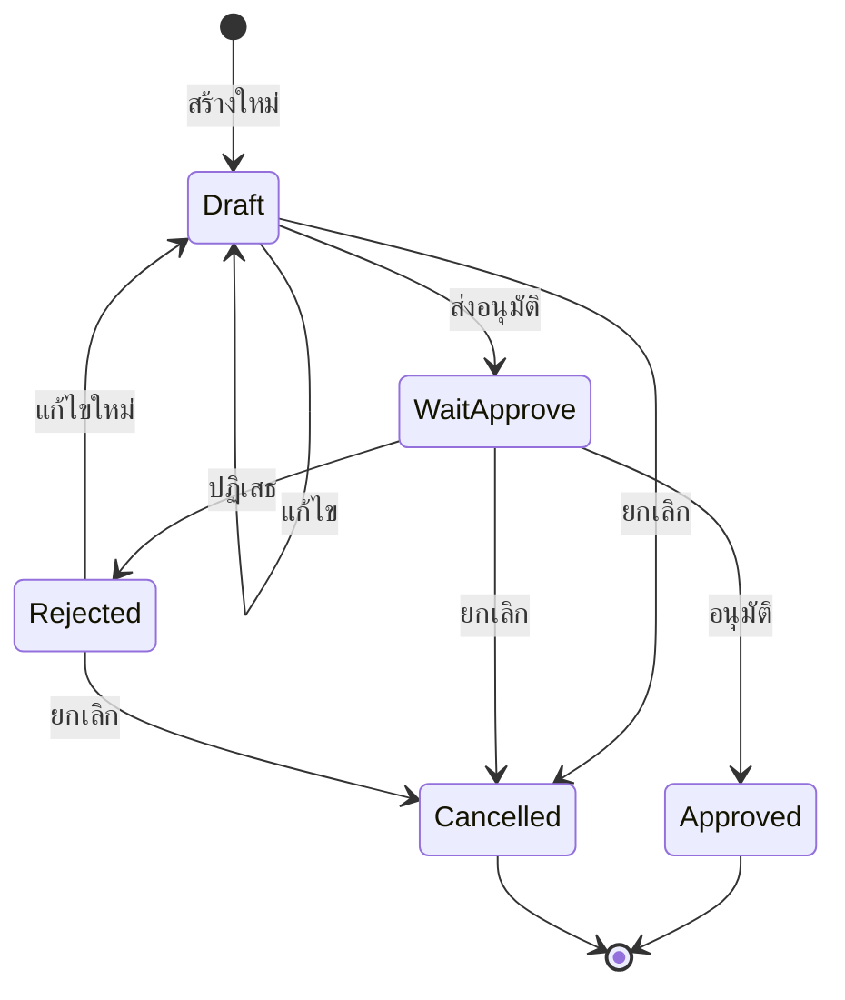
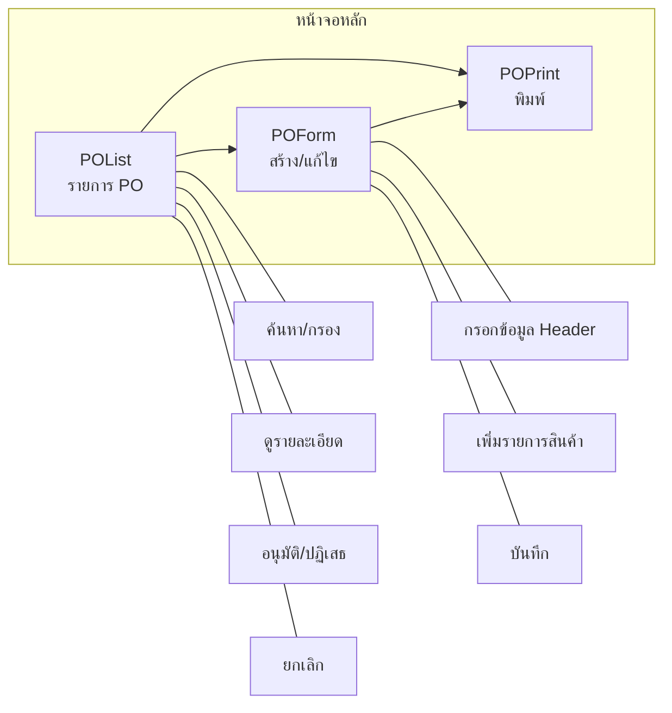

# PO Module - Overview Flow (ภาพรวม)

> สรุป Flow หลักของระบบ Purchase Order แบบเข้าใจง่าย
> อัพเดท: 29 ธันวาคม 2025

---

## 1. ภาพรวมทั้งระบบ

---

## 2. Flow หลัก 5 ขั้นตอน

---

## 3. วงจรสถานะ PO (State Lifecycle)

---

## 4. หน้าจอหลัก 3 หน้า

---

## 5. ใครทำอะไรได้บ้าง

| สถานะ | ผู้สร้าง | ผู้อนุมัติ |
|-------|---------|-----------|
| **Draft** | ✅ แก้ไข, ยกเลิก, ส่งอนุมัติ | - |
| **WaitApprove** | ✅ ยกเลิก | ✅ อนุมัติ, ปฏิเสธ |
| **Approved** | ✅ พิมพ์ | ✅ พิมพ์ |
| **Rejected** | ✅ แก้ไข, ยกเลิก | - |
| **Cancelled** | ✅ พิมพ์ (ดูประวัติ) | - |

---

## 6. สรุปง่ายๆ

| ขั้นตอน | ทำอะไร | หน้าจอ |
|---------|--------|--------|
| **1. สร้าง** | เลือก Supplier + เพิ่มสินค้า | POForm |
| **2. บันทึก** | กด Save → สถานะ Draft | POForm |
| **3. ส่งอนุมัติ** | กด Submit → สถานะ WaitApprove | POList |
| **4. อนุมัติ** | ผู้มีสิทธิ์กด Approve/Reject | POList |
| **5. พิมพ์** | พิมพ์เอกสาร PO | POPrint |

---

*บันทึกโดย: AI Assistant*
*สำหรับ: ปิงปอง* 📊
