# PO Module - Overview Flow (ภาพรวม)

> สรุป Flow หลักของระบบ Purchase Order แบบเข้าใจง่าย
> อัพเดท: 29 ธันวาคม 2025

---

## 1. ภาพรวมทั้งระบบ

```mermaid
flowchart LR
    subgraph PO["PO Module"]
        Create[สร้าง PO] --> Approve[อนุมัติ PO]
        Approve --> Print[พิมพ์ PO]
        Create --> Edit[แก้ไข PO]
        Approve --> Cancel[ยกเลิก PO]
    end
```

---

## 2. Flow หลัก 5 ขั้นตอน

```mermaid
flowchart LR
    A[1. สร้าง] --> B[2. บันทึก Draft]
    B --> C[3. ส่งอนุมัติ]
    C --> D[4. อนุมัติ]
    D --> E[5. พิมพ์]

    B --> F[แก้ไข]
    F --> B
    D --> G[ปฏิเสธ]
    G --> F
```

---

## 3. วงจรสถานะ PO (State Lifecycle)

```mermaid
stateDiagram-v2
    [*] --> Draft: สร้างใหม่

    Draft --> Draft: แก้ไข
    Draft --> WaitApprove: ส่งอนุมัติ
    Draft --> Cancelled: ยกเลิก

    WaitApprove --> Approved: อนุมัติ
    WaitApprove --> Rejected: ปฏิเสธ
    WaitApprove --> Cancelled: ยกเลิก

    Rejected --> Draft: แก้ไขใหม่
    Rejected --> Cancelled: ยกเลิก

    Approved --> [*]
    Cancelled --> [*]
```

---

## 4. หน้าจอหลัก 3 หน้า

```mermaid
flowchart LR
    subgraph Pages["หน้าจอหลัก"]
        List[POList<br/>รายการ PO] --> Form[POForm<br/>สร้าง/แก้ไข]
        Form --> Print[POPrint<br/>พิมพ์]
        List --> Print
    end

    List --- L1[ค้นหา/กรอง]
    List --- L2[ดูรายละเอียด]
    List --- L3[อนุมัติ/ปฏิเสธ]
    List --- L4[ยกเลิก]

    Form --- F1[กรอกข้อมูล Header]
    Form --- F2[เพิ่มรายการสินค้า]
    Form --- F3[บันทึก]
```

---

## 5. ใครทำอะไรได้บ้าง

| สถานะ | ผู้สร้าง | ผู้อนุมัติ |
|-------|---------|-----------|
| **Draft** | ✅ แก้ไข, ยกเลิก, ส่งอนุมัติ | - |
| **WaitApprove** | ✅ ยกเลิก | ✅ อนุมัติ, ปฏิเสธ |
| **Approved** | ✅ พิมพ์ | ✅ พิมพ์ |
| **Rejected** | ✅ แก้ไข, ยกเลิก | - |
| **Cancelled** | ✅ พิมพ์ (ดูประวัติ) | - |

---

## 6. สรุปง่ายๆ

| ขั้นตอน | ทำอะไร | หน้าจอ |
|---------|--------|--------|
| **1. สร้าง** | เลือก Supplier + เพิ่มสินค้า | POForm |
| **2. บันทึก** | กด Save → สถานะ Draft | POForm |
| **3. ส่งอนุมัติ** | กด Submit → สถานะ WaitApprove | POList |
| **4. อนุมัติ** | ผู้มีสิทธิ์กด Approve/Reject | POList |
| **5. พิมพ์** | พิมพ์เอกสาร PO | POPrint |

---

*บันทึกโดย: AI Assistant*
*สำหรับ: ปิงปอง* 📊
