# PO Module - User Flow (จัดเต็ม)

> รวม Flow การใช้งานระบบ Purchase Order ทั้งหมด
> อัพเดท: 29 ธันวาคม 2025

---

## 📋 สรุปหน้าและ Actions

| หน้า | Actions ที่ทำได้ |
|------|-----------------|
| **POList** | ดู, ค้นหา, กรอง, สร้าง, แก้ไข, ดูรายละเอียด, ยกเลิก, อนุมัติ, ปฏิเสธ, พิมพ์ |
| **POForm** | กรอกข้อมูล, เลือก Supplier, เพิ่ม/ลบ รายการสินค้า, บันทึก |
| **POPrintPreview** | ดูตัวอย่าง, พิมพ์เอกสาร |

---

## 1. หน้า POList - รายการใบสั่งซื้อ

### 1.1 เข้าหน้า POList

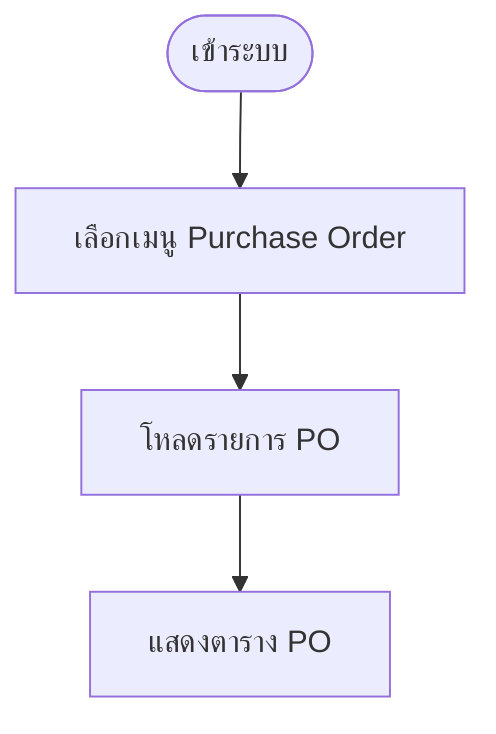

---

### 1.2 ค้นหาและกรอง

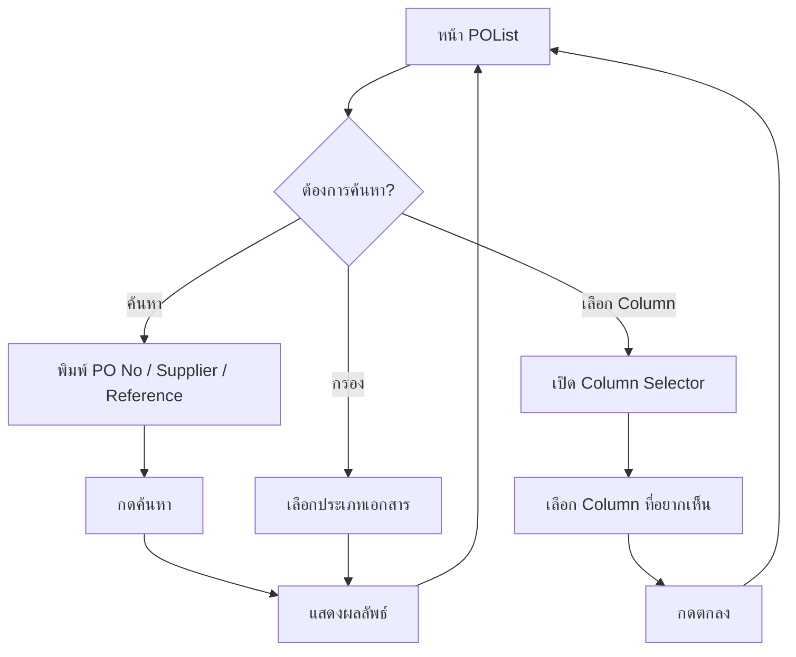

---

### 1.3 สร้าง PO ใหม่

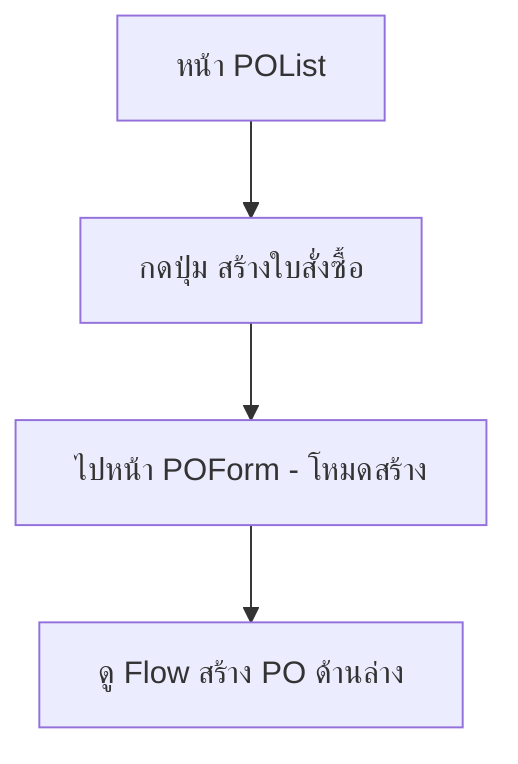

---

### 1.4 ดูรายละเอียด PO

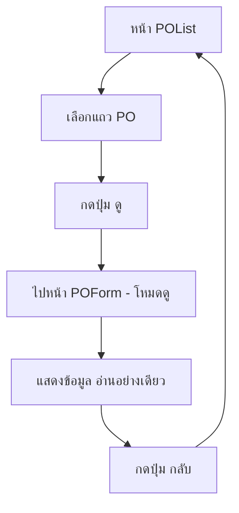

---

### 1.5 แก้ไข PO

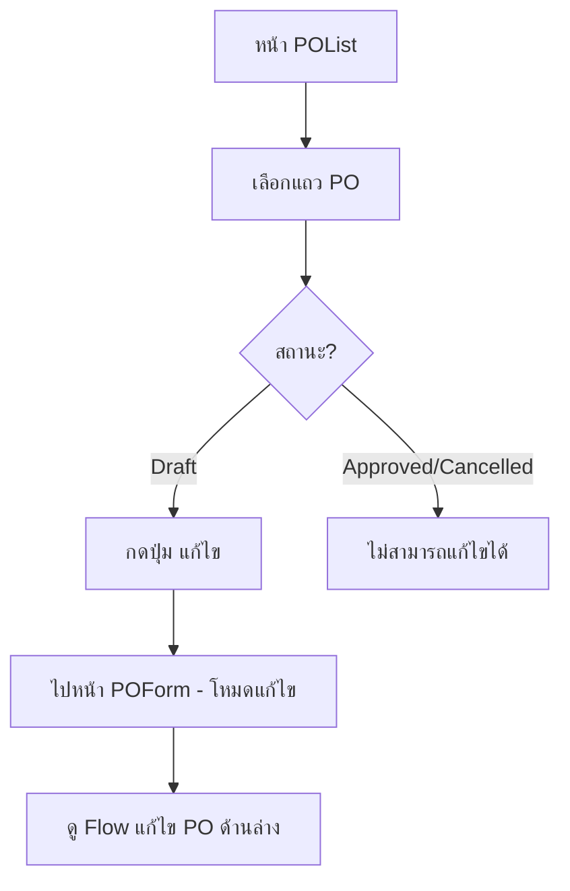

---

### 1.6 ยกเลิก PO

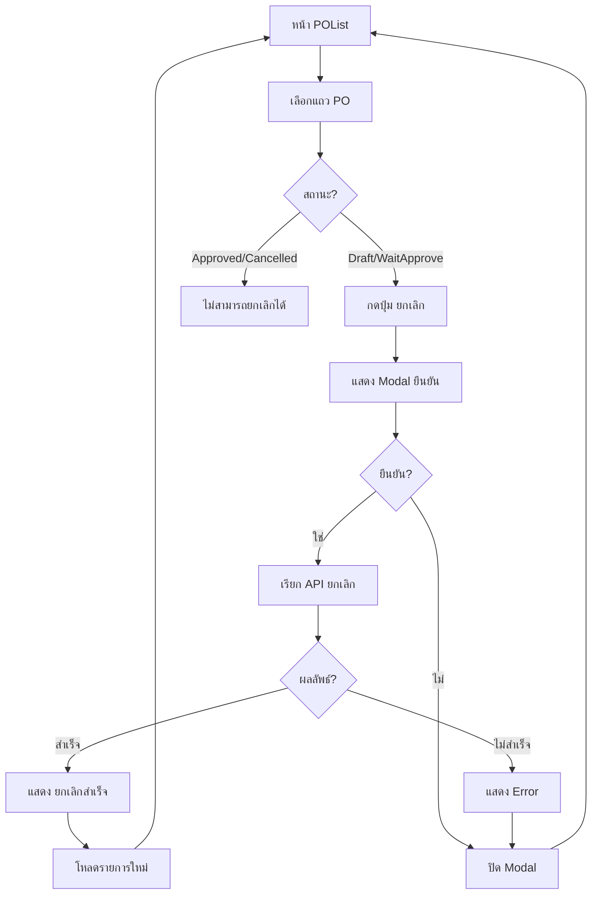

---

### 1.7 อนุมัติ PO

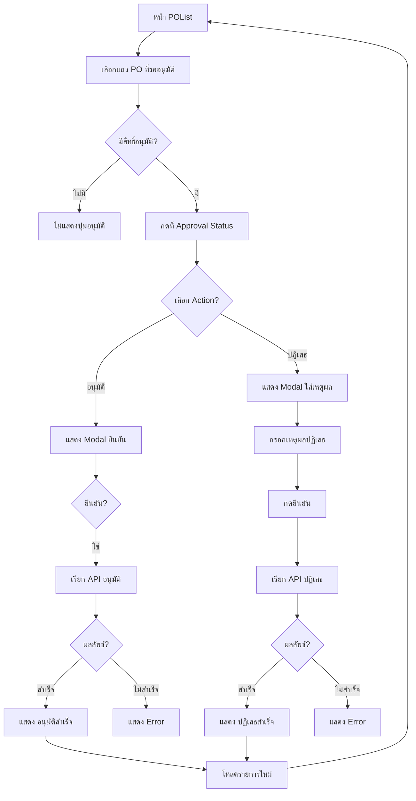

---

### 1.8 พิมพ์ PO

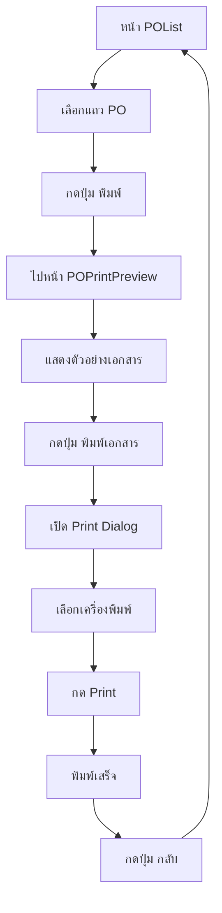

---

## 2. หน้า POForm - สร้าง PO ใหม่

### 2.1 Flow สร้าง PO แบบเต็ม

```mermaid
flowchart TD
    Start([เข้าหน้า POForm]) --> LoadMaster[โหลด Master Data]
    LoadMaster --> ShowForm[แสดง Form ว่าง]

    %% Step 1: เลือก Document Type
    ShowForm --> SelectDocType[เลือกประเภทเอกสาร]
    SelectDocType --> GeneratePONo[ระบบสร้างเลข PO อัตโนมัติ]

    %% Step 2: เลือก Supplier
    GeneratePONo --> ClickSearchSupplier[กดค้นหาผู้ขาย]
    ClickSearchSupplier --> OpenSupplierModal[เปิด Modal ค้นหา Supplier]
    OpenSupplierModal --> SearchSupplier[พิมพ์ค้นหา Supplier]
    SearchSupplier --> SelectSupplier[เลือก Supplier]
    SelectSupplier --> FillSupplierInfo[ระบบดึงข้อมูล Supplier อัตโนมัติ]

    %% Step 3: กรอกข้อมูล Header
    FillSupplierInfo --> InputHeader[กรอกข้อมูลเพิ่มเติม]

    subgraph HeaderInfo["ข้อมูล Header"]
        InputHeader --> SelectWarehouse[เลือกคลังสินค้า]
        SelectWarehouse --> SelectCurrency[เลือกสกุลเงิน]
        SelectCurrency --> InputShipDate[กรอกวันที่ส่งของ]
        InputShipDate --> AutoPaymentDue[ระบบคำนวณ Payment Due อัตโนมัติ]
    end

    %% Step 4: เพิ่มรายการสินค้า
    AutoPaymentDue --> AddLineItem[กดเพิ่มรายการสินค้า]

    subgraph LineItems["รายการสินค้า"]
        AddLineItem --> ClickSearchItem[กดค้นหาสินค้า]
        ClickSearchItem --> OpenItemModal[เปิด Modal ค้นหา Item]
        OpenItemModal --> SearchItem[พิมพ์ค้นหา Item]
        SearchItem --> SelectItem[เลือก Item]
        SelectItem --> FillItemInfo[ระบบดึงข้อมูล Item อัตโนมัติ]
        FillItemInfo --> InputQty[กรอกจำนวน]
        InputQty --> InputPrice[กรอกราคาต่อหน่วย]
        InputPrice --> InputDiscount[กรอกส่วนลด - ถ้ามี]
        InputDiscount --> AutoCalcLine[ระบบคำนวณยอดรายการ]
    end

    AutoCalcLine --> MoreItems{เพิ่มสินค้าอีก?}
    MoreItems -->|ใช่| AddLineItem
    MoreItems -->|ไม่| CheckLineItems{มีสินค้าอย่างน้อย 1 รายการ?}

    %% Validation
    CheckLineItems -->|ไม่มี| ShowLineError[แสดง Error: ต้องมีสินค้าอย่างน้อย 1 รายการ]
    ShowLineError --> AddLineItem

    CheckLineItems -->|มี| AutoCalcSummary[ระบบคำนวณ Summary]

    subgraph Summary["สรุปยอด"]
        AutoCalcSummary --> CalcSubtotal[รวมเงินสินค้า]
        CalcSubtotal --> CalcDiscount[หักส่วนลดรวม]
        CalcDiscount --> CalcBeforeVAT[มูลค่าก่อน VAT]
        CalcBeforeVAT --> CalcVAT[คำนวณ VAT]
        CalcVAT --> CalcTotal[ยอดรวมทั้งสิ้น]
    end

    %% Step 5: กรอกข้อมูลเพิ่มเติม
    CalcTotal --> InputNote[กรอกหมายเหตุ - ถ้ามี]
    InputNote --> InputReference[กรอกเอกสารอ้างอิง - ถ้ามี]

    %% Step 6: บันทึก
    InputReference --> ClickSave[กดปุ่ม บันทึก]
    ClickSave --> ValidateForm{ข้อมูลครบถ้วน?}

    ValidateForm -->|ไม่ครบ| ShowValidationError[แสดง Error ที่ต้องแก้]
    ShowValidationError --> HighlightFields[Highlight ช่องที่ผิด]
    HighlightFields --> ShowForm

    ValidateForm -->|ครบ| ShowSaveConfirm[แสดง Modal ยืนยันบันทึก]
    ShowSaveConfirm --> ConfirmSave{ยืนยัน?}

    ConfirmSave -->|ไม่| CloseSaveModal[ปิด Modal]
    CloseSaveModal --> ShowForm

    ConfirmSave -->|ใช่| ShowSaving[แสดง Saving...]
    ShowSaving --> CallInsertAPI[เรียก API บันทึก]
    CallInsertAPI --> SaveResult{ผลลัพธ์?}

    SaveResult -->|สำเร็จ| ShowSaveSuccess[แสดง บันทึกสำเร็จ]
    ShowSaveSuccess --> GoToList[กลับหน้า POList]

    SaveResult -->|ไม่สำเร็จ| ShowSaveError[แสดง Error จาก API]
    ShowSaveError --> CloseSaveModal
```

---

### 2.2 Validation Rules สำหรับสร้าง PO

| ฟิลด์ | เงื่อนไข | Error Message |
|-------|---------|---------------|
| ประเภทเอกสาร | ต้องเลือก | กรุณาเลือกประเภทเอกสาร |
| ผู้ขาย | ต้องเลือก | กรุณาเลือกผู้ขาย |
| คลังสินค้า | ต้องเลือก | กรุณาเลือกคลังสินค้า |
| สกุลเงิน | ต้องเลือก | กรุณาเลือกสกุลเงิน |
| รายการสินค้า | ต้องมีอย่างน้อย 1 รายการ | กรุณาเพิ่มสินค้าอย่างน้อย 1 รายการ |
| จำนวน | ต้อง > 0 | จำนวนต้องมากกว่า 0 |
| ราคาต่อหน่วย | ต้อง >= 0 | ราคาต้องไม่ติดลบ |

---

## 3. หน้า POForm - แก้ไข PO

### 3.1 Flow แก้ไข PO

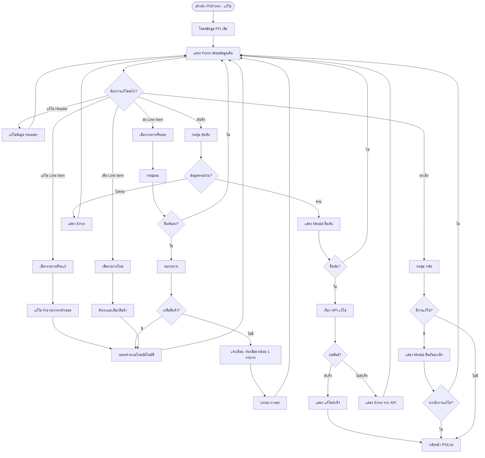

---

## 4. สรุป Flow ทั้งหมด

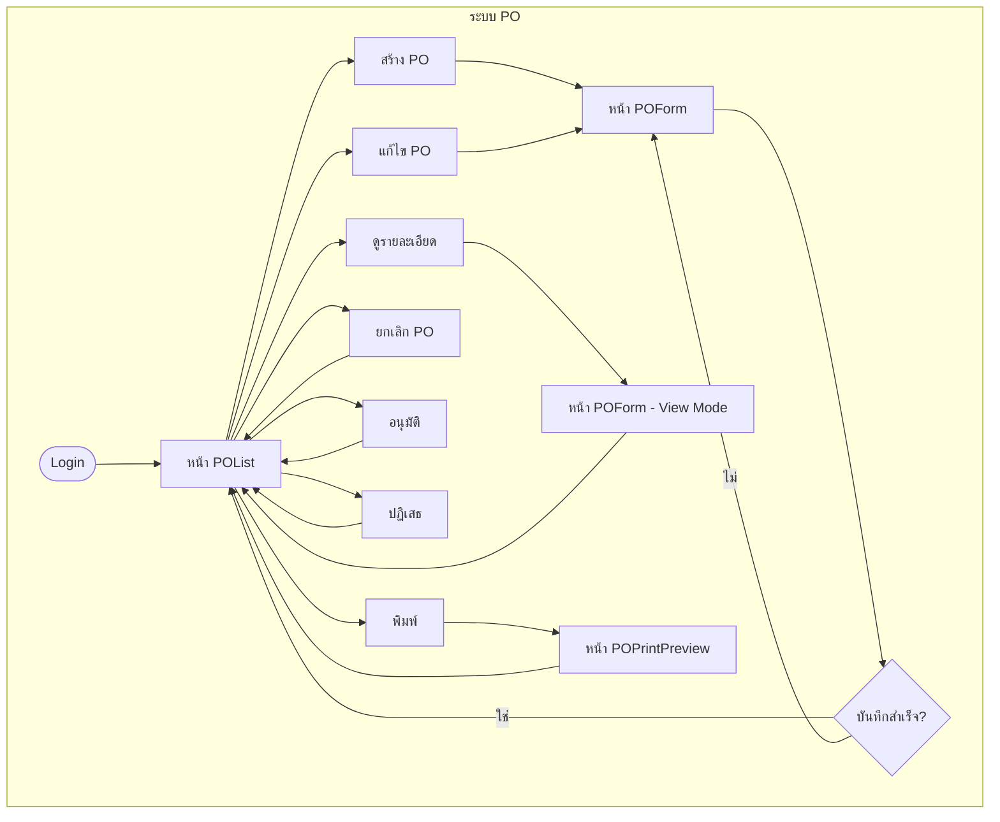

---

## 5. สถานะ PO และ Actions ที่ทำได้

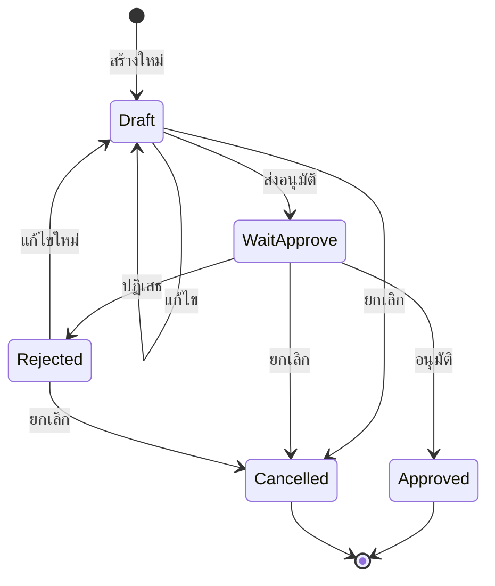

| สถานะ | สร้าง | แก้ไข | ยกเลิก | อนุมัติ | ปฏิเสธ | พิมพ์ |
|-------|------|------|-------|--------|-------|------|
| Draft | - | ✅ | ✅ | - | - | ✅ |
| WaitApprove | - | ❌ | ✅ | ✅ | ✅ | ✅ |
| Approved | - | ❌ | ❌ | - | - | ✅ |
| Rejected | - | ✅ | ✅ | - | - | ✅ |
| Cancelled | - | ❌ | ❌ | - | - | ✅ |

---

*อัพเดทโดย: AI Assistant*
*สำหรับ: ปิงปอง* 📊
