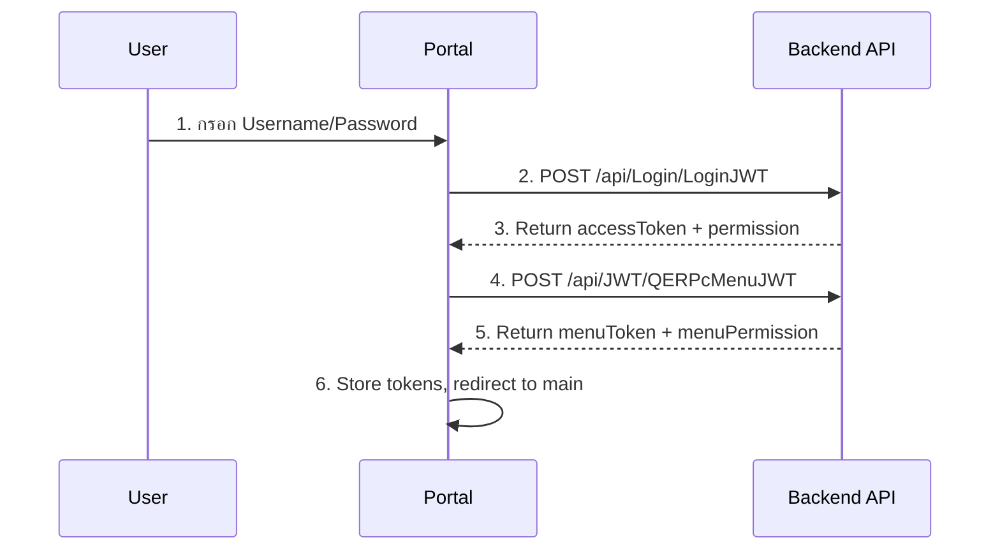
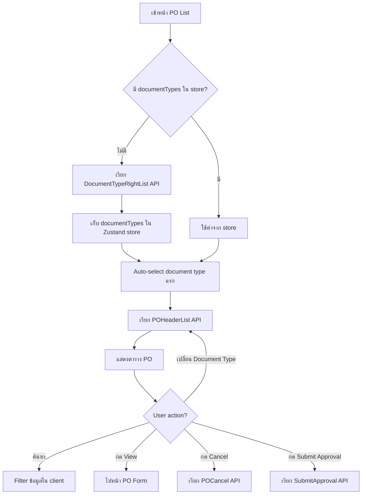
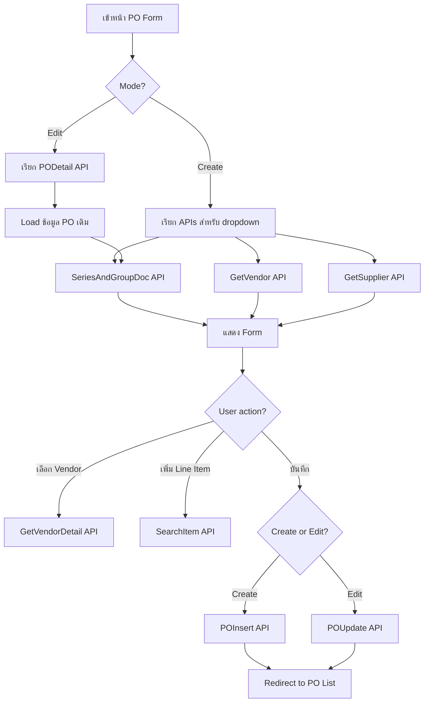
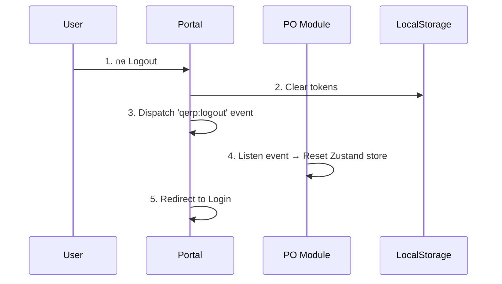

# Purchase Order Module - Flow & API Documentation

> เอกสารนี้อธิบาย flow การทำงานของ PO Module และ API ที่ถูกเรียกในแต่ละขั้นตอน

---

## 1. Authentication Flow



### APIs ที่เกี่ยวข้อง

| ลำดับ | API | Method | หน้าที่ |
|-------|-----|--------|--------|
| 1 | `/api/Login/LoginJWT` | POST | Login และได้ accessToken |
| 2 | `/api/JWT/QERPcMenuJWT` | POST | ได้ menu permission และ menuToken |
| 3 | `/api/JWT/QERPcMenuActionJWT/{moduleCode}` | GET | ได้ action permission ของ module |

---

## 2. PO List Page Flow



### APIs ที่เกี่ยวข้อง

| Trigger | API | Method | หน้าที่ |
|---------|-----|--------|--------|
| เข้าหน้า (ครั้งแรก) | `/api/Document/DocumentTypeRightList` | GET | ดึงประเภทเอกสารที่มีสิทธิ์ |
| เลือก Document Type | `/api/POHeader/POHeaderList` | GET | ดึงรายการ PO |
| กด Cancel | `/api/POHeader/POCancel` | POST | ยกเลิก PO |
| กด Submit Approval | `/api/Approval/SubmitApproval` | POST | ส่งอนุมัติ |

### Query Parameters

```typescript
// DocumentTypeRightList
{
  moduleCode: 'PO',
  userName: string
}

// POHeaderList
{
  documentTypeCode: string,  // จาก dropdown
  // ... other filters
}
```

---

## 3. PO Form Page Flow (Create/Edit)



### APIs ที่เกี่ยวข้อง

| Trigger | API | Method | หน้าที่ |
|---------|-----|--------|--------|
| เข้าหน้า | `/api/Series/SeriesAndGroupDoc` | GET | ดึง Series สำหรับเลขที่เอกสาร |
| เข้าหน้า | `/api/Vendor/GetVendor` | GET | ดึงรายชื่อ Vendor |
| เข้าหน้า | `/api/Supplier/GetSupplier` | GET | ดึงรายชื่อ Supplier |
| Edit Mode | `/api/POHeader/PODetail` | GET | ดึงรายละเอียด PO |
| เลือก Vendor | `/api/Vendor/GetVendorDetail` | GET | ดึงรายละเอียด Vendor |
| เพิ่ม Item | `/api/Item/SearchItem` | GET | ค้นหาสินค้า |
| บันทึก (Create) | `/api/POHeader/POInsert` | POST | สร้าง PO ใหม่ |
| บันทึก (Edit) | `/api/POHeader/POUpdate` | PUT | แก้ไข PO |

---

## 4. Logout Flow



### สิ่งที่ต้อง Clear ตอน Logout

| ที่เก็บ | ข้อมูล | ใครเป็นคน Clear |
|--------|--------|-----------------|
| localStorage | accessToken, permission, username | Portal (authService.logout) |
| AuthContext | isAuthenticated, tokens | Portal (setState) |
| PO Zustand Store | documentTypes, poHeaders | PO Module (listen event) |

---

## 5. State Management

### Zustand Store Structure

```typescript
// poStore
{
  documentTypes: DocumentType[]      // Cache - โหลดครั้งเดียว
  selectedDocumentTypeCode: string   // User selection
  poHeaders: POHeader[]              // List data
  isLoadingDocTypes: boolean
  isLoadingPOHeaders: boolean
  searchText: string
}
```

### Cache Strategy

| Data | Cache Location | Invalidate เมื่อ |
|------|---------------|------------------|
| documentTypes | Zustand store | Logout, เปลี่ยน Company |
| poHeaders | Zustand store | เปลี่ยน documentType, Refresh |
| Vendor list | React Query (ถ้ามี) | - |

---

## 6. API Response Format

### Standard Response

```typescript
interface ApiResponse<T> {
  code: number      // 0 = success
  msg: string | null
  result: T | null
}
```

### Error Codes

| Code | ความหมาย |
|------|----------|
| 0 | สำเร็จ |
| 1 | ข้อมูลไม่ถูกต้อง |
| 2 | ไม่มีสิทธิ์ |
| 401 | Token หมดอายุ |

---

## 7. File References

| หน้าที่ | ไฟล์ |
|--------|------|
| PO List Page | `src/pages/POList.tsx` |
| PO Form Page | `src/pages/POForm.tsx` |
| PO List Hook | `src/hooks/usePOListData.ts` |
| PO Form Hook | `src/hooks/usePOFormData.ts` |
| Zustand Store | `src/stores/poStore.ts` |
| API Services | `src/services/*.ts` |

---

*อัพเดทล่าสุด: 8 มกราคม 2026*
